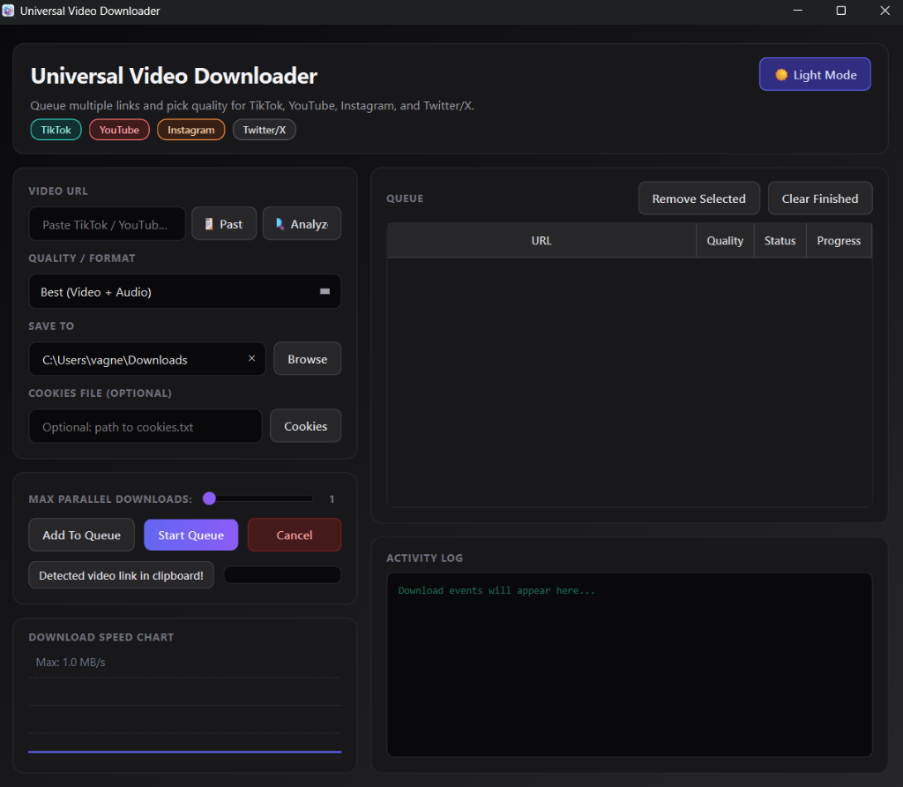

# Video Downloader



A premium desktop video downloader built with **PySide6** and powered by **yt-dlp**. It features an obsidian dark dashboard, dynamic format analyzer, concurrent multi-threading queue, real-time speed speedometer charts, and seamless clipboard/drag-and-drop integration.

## Features

- **Dynamic Format Analyzer (`🔍 Analyze`)**: Probes video URLs to retrieve all available formats/resolutions and estimated file sizes before enqueuing.
- **Concurrent Downloads Thread Pool**: Enqueue multiple links and download them in parallel. Features a dynamic slider to set max parallel threads (1 to 5).
- **Real-Time Bandwidth Speed Chart**: A custom area gradient chart showcasing live download speed history.
- **Smart Clipboard Integration**: Auto-detects video links in the clipboard on focus and auto-populates the input field. Also features a dedicated one-click `📋 Paste` button.
- **Drag-and-Drop Enqueuing**: Drag and drop links, browser selections, or `.txt` files containing lists of URLs directly onto the dashboard to parse and queue them.
- **System Tray & Notifications**: Minimize to tray with active desktop balloon notifications on queue completions and window state changes.
- **Premium obsidian layout**: A responsive split-pane UI containing a sidebar controller and main table layout with customized rounded scrollbars and badge elements.

## Setup

### Option 1: uv (recommended)

1. Create a virtual environment:
   ```powershell
   uv venv
   ```

2. Install dependencies:
   ```powershell
   uv sync
   ```

3. Run the app:
   ```powershell
   uv run main.py
   ```

4. Or run the app entry point:
   ```powershell
   uv run video-downloader
   ```

### Option 2: pip

1. Create and activate a virtual environment:
   ```powershell
   python -m venv .venv
   .\.venv\Scripts\Activate.ps1
   ```

2. Install dependencies:
   ```powershell
   pip install -r requirements.txt
   ```

3. Run:
   ```powershell
   python main.py
   ```

## Usage

1. Paste a video URL (or let the auto-detect fill it on focus).
2. Click `🔍 Analyze` to retrieve custom resolutions, or pick a default format.
3. Select the desired destination folder.
4. Click `Add To Queue` (or drag and drop URLs into the queue table).
5. Adjust the **Max Parallel Downloads** slider.
6. Click `Start Queue`.

## Notes

- **Private Content**: Use the optional cookies file path input if downloading restricted or private videos that require account authorization.
- **Audio Conversion**: Extracting audio to MP3 requires `ffmpeg` to be installed and available in the system `PATH`.
- Update `yt-dlp` regularly to adapt to site changes:
  ```powershell
  pip install -U yt-dlp
  ```
